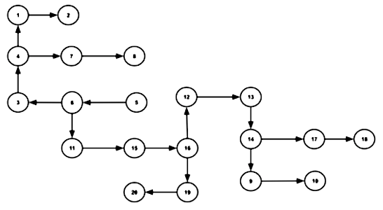

# Instructions

Imagine that the following graph describes a maze. Use a predicate called **connected** to build a knowledge base that represents the maze. The predicate determines which points are connected, that is, from which points you can get to which points **in one step**. Furthermore, imagine that all paths are one-way streets, so that you can only walk them in one direction. 

Using the knowledge based built, write a (recursive) predicate path/2 that tells you from which points in the maze you can get to which other points when chaining together connections given the above KB. Then have Prolog answer the following queries: 

* can you get from point 5 to point 10? 
* which other points can you get to when starting at point 1? 
* which points can be reached from point 13?  

