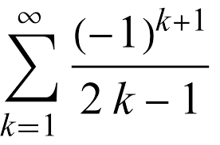

## Introduction

Lua is a programming language developed at [PUC-Rio](http://www.puc-rio.br/english/) (my **alma mater**) by professor [Roberto Ierusalimschy](http://www.inf.puc-rio.br/~roberto/) in 1993. Documentation can be found [here](https://www.lua.org/manual/5.4/). 

## Hello World

```
print("Hello World!")
```

## Basic I/O

I/O in Lua is done using **io.read** and **io.write** functions, respectively. By default, a call to **io.read()** reads the input as a string. To read numbers use **io.read("*number")**, which can be shorten to **io.read("*n")**. **io.write** accepts a list of values separated by comma. **string.format** provides formatting options and variable substitution. 

```
-- defines a factorial function
function fact(n)
    if n == 0 then
        return 1
    else
        return n * fact(n - 1)
    end
end

io.write("n? ") -- or simply print("n? ")
n = io.read("*number") -- or simply io.read("*n")
print(n, "! is ", fact(n))
print(string.format("%d! is %d", n, fact(n)))
```

## Types and Values

Lua is dynamically-typed. Below are the built-in types in Lua: 

* **nil**: non-value
* **Boolean**: **true** or **false**
* **number**
* **string**
* **userdata**
* **function**
* **thread**
* **table**

You can use the function **type** to get the type of any given expression. 

## Basic Math Operators

The example below illustrates how to write basic math expressions in Lua. The number PI can be computed by multiplying the following series by 4:



The following program computes an approximation of PI. 

```
-- computes a pi approximation up to n-term
function pi_helper(n)
    if n == 1 then
        return 1
    else
        return ((-1)^(n+1))/(2*n-1) + pi_helper(n-1)
    end
end

function pi(n)
    return 4*pi_helper(n)
end

print("n? ")
n = io.read()
print(pi(n))
```

## Counted Loops

The following program illustrates how to write simple counted loops in Lua to perform a summation. 

```
-- simple summation
s = 0
for i = 1, 10 do
    s = s + i 
end
print(s)
```

Same example using a while loop. 

```
-- simple summation
s = 0
i = 1
while i <= 10 do
    s = s + i 
    i = i + 1
end
print(s)
```

## Tables

One of the most versatile type in Lua is the table, which essentially is an associative array. A table is an array that accepts not only numbers as indices, but also strings or any other value of the language (except nil). 

```
students = { }
students[123] = "John"
students[345] = "Mary"
students[678] = "Xavier"
print("id? ")
id = io.read("*n")
print(students[id])
```

Alternatively: 

```
students = { [123] = "John", [345] = "Mary", [678] = "Xavier" }
print("id? ")
id = io.read("*n")
print(students[id]) -- or print(students.[id])
```

Tables can also be used to create simple collections. The following example shows a collection of tables representing students. 

```
students = { 
    { id = 123, name = "John" },
    { id = 345, name = "Mary" }, 
    { id = 678, name = "Xavier" }
}
print("id? ")
id = io.read("*n")
for _, std in pairs(students) do 
    if std.id == id then
        print(std.name)
        break
    end
end
```

## Closures

Closure is a term used in PL to refer to an "instance" of a function. For example, consider the function **counter** below. 

```
function counter(from)
    local count = from
    return function() 
        count = count + 1
        return count
    end
end

x = counter(10) -- x is a closure (instance of counter with from=10)
print(x()) -- displays 11
print(x()) -- displays 12
print(x()) -- displays 13

y = counter(100) -- y is another closure (instance of counter with from=100)
print(y()) -- displays 101
print(y()) -- displays 102
print(y()) -- displays 103
```

Closures allow functions to have **memory** and can be used to implement iterators. 

## Iterators

As discussed before, an **iterator** is a PL construct that allows us to iterate over the elements of a collection. Iterators in Lua are implemented as functions: each time we call the function, it returns the next element from the collection. The example below illustrates how to create a simple iterator for a collection. 

```
function my_iterator(collection)
    local i = 0
    return function () 
        i = i + 1 
        next = collection[i] 
        return next 
    end
end

collection = { 5, 8, 2, 1, 9 }
for el in my_iterator(collection) do
    print(el)
end
```

Lua makes two generic iterators avaiable: **pairs** and **ipairs**. They both return key,value pairs, with the difference that **ipairs** sorts by keys. Note that **ipairs** only works on tables that have sequential elements beginning at 1

## Functional Programming Features

Functions in Lua are first-class values with proper lexical scoping. Therefore, a program can store functions in variables, pass functions as arguments to other functions, and return functions as results. 

The following example illustrates a simple filter function. 

```
function even(x)
    return x % 2 == 0
end

function filter(lst, pred) 
    local result = {}
    for i, v in pairs(lst) do
        if pred(v) then 
            table.insert(result, v)
        end 
    end
    return result 
end

lst = { 1, 2, 3, 4, 5, 6, 7, 8, 9, 10 }
result = filter(lst, even)
for i, v in pairs(result) do 
    print(v)
end
```

There is no need to write the code above as most commonly used higher-order functions are available in Lua. For example, using the built-in filter function: 

## Practice

### Exercise 1

Write an iterator that returns all substrings of a given string. For example, all substrings of "Hello Lua!": 

```
H
He
Hel
Hell
Hello
Hello 
Hello L
Hello Lu
Hello Lua
Hello Lua!
e
el
ell
ello
ello 
ello L
ello Lu
ello Lua
ello Lua!
l
ll
llo
llo 
llo L
llo Lu
llo Lua
llo Lua!
l
lo
lo 
lo L
lo Lu
lo Lua
lo Lua!
o
o 
o L
o Lu
o Lua
o Lua!
 
 L
 Lu
 Lua
 Lua!
L
Lu
Lua
Lua!
u
ua
ua!
a
a!
!
```

### Exercise 2

Use Lua's table to implement a singly-linked list, as shown in the example below: 

```
list = nil
list = { next = list, value = 5}
list = { next = list, value = 8}
list = { next = list, value = 3}
```

Write an iterator for the linked list. 

```
function it(list)
    --- finish
end
```

Use the iterator to print the elements of the list. 

### Exercise 3

Use Lua's table **insert** and **remove** methods to implement a queue. 

### Exercise 4

Use Lua to read a sudoku configuration into a 2D table. You can assume the configuration is hard-coded in a string. 

```
sudoku = "035269780\n680571093\n107034562\n026195040\n304080915\n901043608\n019320804\n208057036\n703018059"
```

A useful function when working with strings is **gmatch** which returns a pattern finding iterator. The iterator will search through the string passed looking for instances of the pattern you passed.

### Exercise 5

Using the sudoku 2D board created in the previous example, write an iterator that returns the (i, j) pairs having zero. If you are done, extend the iterator to return new board configurations by setting digits to the (i, j) locations. 