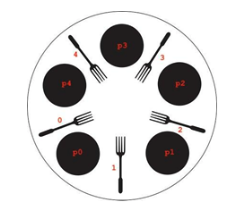

# Introduction 

Imagine this scenario: five philosophers sit together at a table to eat pasta. They need two forks to eat. However, there are only five forks, but they don’t mind sharing utensils with each other. Each of them starts by trying to take the fork on the left side. Then they try to take the fork on the right side. If succeeded, they think for a random amount of time (philosophers like to think all the time) and also eat for a random time, releasing the right fork, and then the left fork.  

This is a situation that can cause a concurrency problem known as deadlock.  In a deadlock, each participant is waiting for others to release a resource that they want.  But because no participants are willing to release their resources, no progress is made and they all wait indefinitely. In this activity you will simulate the dining philosopher problem and figure it out a way to work around deadlock conditions like that. 



# The Philosopher Class

Write a Philosopher class that implements the Runnable interface.  The class should define two instance variables: leftFork and rightFork.  Because locks in Java can only be assigned to objects, define the forks as Object types.  

The Philosopher constructor accepts two references for the fork objects. The class should implement a think method that has the thread sleep for a random amount of time limited to a maximum of 10ms. Also, the class should have an eat method that has the thread sleep for a random amount of time limited to a maximum of 50ms. The thread’s run method should constantly have the philosopher doing the following:  

* try to acquire the left fork,  
* think,  
* try to acquire the right fork,  
* eat. 

Remember, the forks are the resources in this problem and they require exclusive access.  To gain exclusive access to an object in Java you use synchronized statements.  See example below.  

```
synchronize(obj) { 
   // exclusive access to obj 
} 
```

# The DiningPhilosophersProblem Class 

This class implements an application that simulates the dining philosopher problem. It should have five fork objects (the resources) and five philosophers (the threads). We suggest defining the forks using an array because it simplifies resource allocation. The threads should be named according to the picture in the beginning of this text. Remember, the philosophers always try to acquire the left fork first and then the right fork, thinking and eating in between.  

