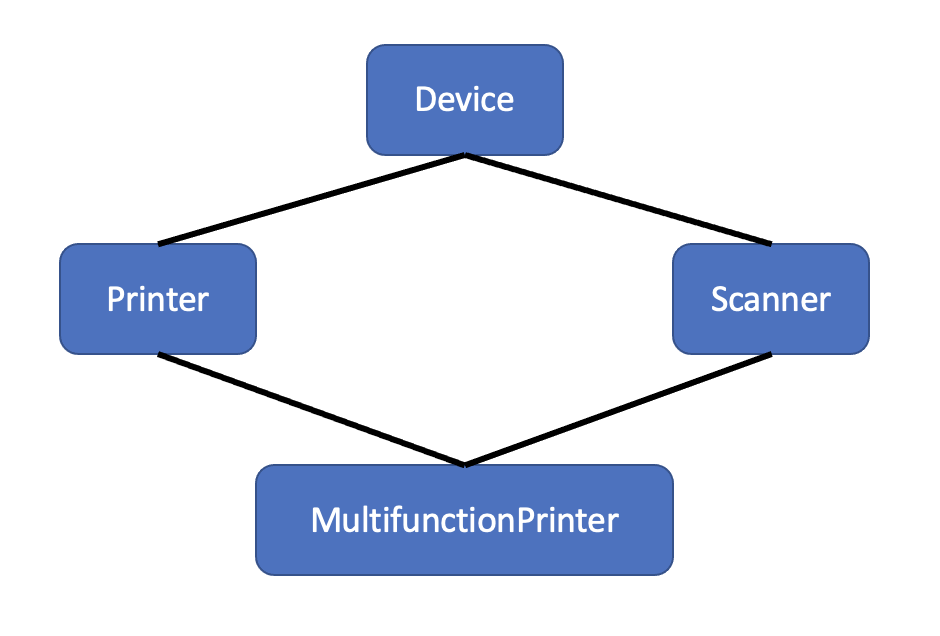

# Overview

The so-called "Diamond Problem" happens when a class inherits from (at least) two other distinct classes that share a common ancestry. To illustrate, consider the example below: 



Assume that the Device class defines a manufacturer, while the Printer class defines a type, and the Scanner class defines a dpi value. The "Diamond Problem" arises when an instance of the MultifunctionPrinter class refers to its manufacturer (instance) variable. Will this instance variable be mapped to the one inherited from Printer or Scanner?

# Instructions

C++ supports multiple inheritance. The example.cpp code implements the scenario described above. Howerver, because of the "Diamond Problem" it fails to pass compilation. You can use an online compiler to test the code by yourself. For example: [programiz.com](https://www.programiz.com/cpp-programming/online-compiler). You should get an error that says: 

```
request for member 'manufacturer' is ambiguous
```

Your first taks is to update the code so it passes compilation and successfully runs. Hint: use a scope resolution when referring to manufacturer. 

Next, you are asked to implement the same code (example.cpp) in Python. You should not get the ambiguous error because Python solves the problem based on an internal depth-first left-to-right name resolution algorithm. 

# Submission

Zip example.cpp and example.py into example.zip. Upload example.zip on Canvas. 